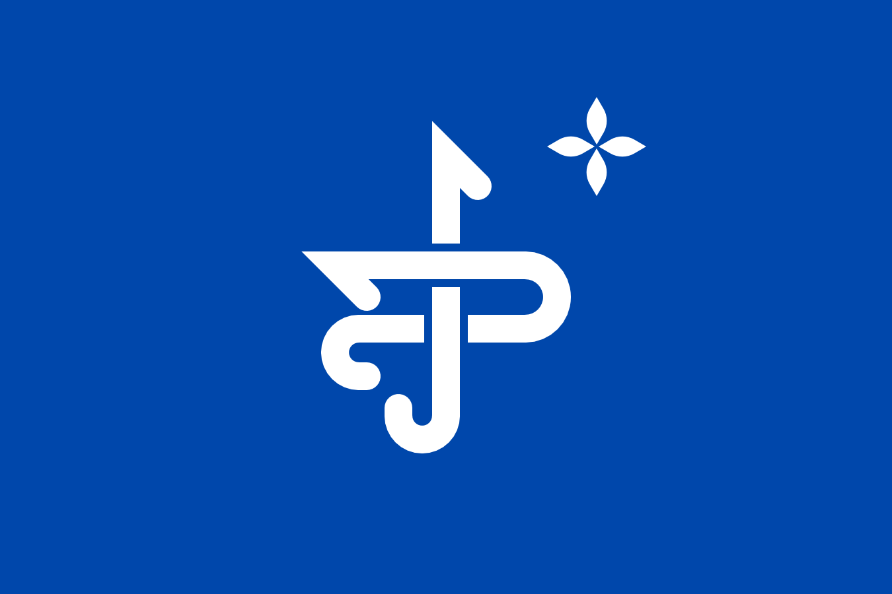
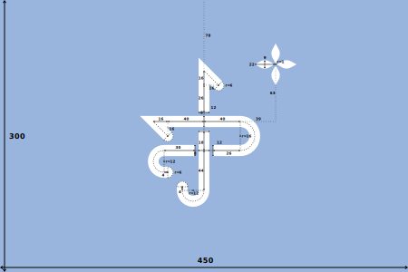

# Kaitag Flag

> The flag of the Kaitag people (**Хайдаҡӏла**) is a blue field with a white seal at its center.
>
> The stylized Kufic monogram from the pantheon of the rulers of Kaitag symbolizes centuries-old statehood.
>
> Above and to the right — a white four-leaf madder flower, once abundantly cultivated across Kaitag.
>
> Deep blue — the traditional ground of Kaitag embroidery.
>
> Proportions 2:3 (swallowtail 1:2). Color #0047AB / PMS 300 C.

For historical background, references, and interactive preview, see [urssivar.com/flag](https://urssivar.com/flag).

## Specification

| Property    | Value                         |
| ----------- | ----------------------------- |
| Proportions | 2:3                           |
| Color       | #0047AB / PMS 300 C           |
| Elements    | White seal: monogram + flower |

## Elements

### Field

Deep blue is the canonical ground of Kaitag embroidery, documented by ethnographer E. M. Shilling.[^1]

### Monogram

A stylized Kufic monogram of a Kaitag ruler, drawn from the relief of a 13th-century dynastic sarcophagus[^2] — one of the earliest known monuments of Kaitag statehood.[^3]

### Flower

A four-petal madder flower (_Rubia tinctorum_), a key dye crop of Kaitag, positioned upper-right to balance the monogram's asymmetry.[^1]

## Variants

The swallowtail (1:2) draws on an attested form: the flag of Eldar-Bek of Kara-Kaitag, captured near Derbent on 24 August 1831, was two-tailed[^4] — a common shape among Caucasian War-era banners.

## Files

| File               | Description         |
| ------------------ | ------------------- |
| `flag.svg`         | Vector source       |
| `flag.png`         | Raster export       |
| `swallowtail.svg`  | Swallowtail variant |
| `swallowtail.png`  | Raster export       |
| `construction.svg` | Construction sheet  |

[^1]: Гасанова З. И., Гаджалова Ф. А. _Кайтагская вышивка: от истоков в будущее._ 2-е изд. Дербент: Типография-М, 2022. 176 с.

[^2]: Маммаев М. М. _Искусство Зирихгерана-Кубачи XIII–XV вв. и его место в системе художественных культур Востока и Запада._ Махачкала: Эпоха, 2014. 592 с.

[^3]: Магомедов М. Г., Шихсаидов А. Р. _Калакорейш (Крепость курейшитов)._ Махачкала: Юпитер, 2000. 168 с.

[^4]: Дадаев Ю. У. _Наибы и мудиры Шамиля._ Махачкала, 2009. 624 с.

## License

This work is licensed under [CC BY-SA 4.0](https://creativecommons.org/licenses/by-sa/4.0/). If you use this specification in your work, please cite:

> Magomedov, M. (2026). _Kaitag Flag_. Retrieved from https://github.com/urssivar/flag

Contact: alkaitagi@outlook.com
